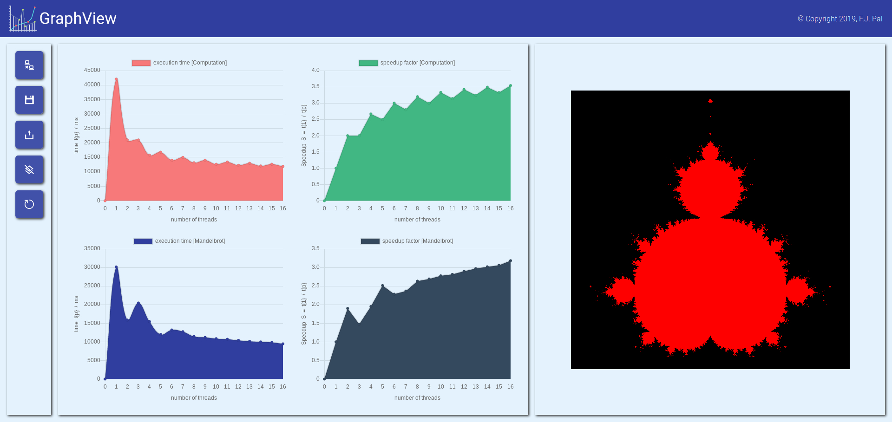

# GraphView

GraphView is a simple example to plot and receive data via a websocket connection from a ESP32 microcontroller running a c++ backend.

## Demo

...

## Quick start

...

## Environment Setup

...
